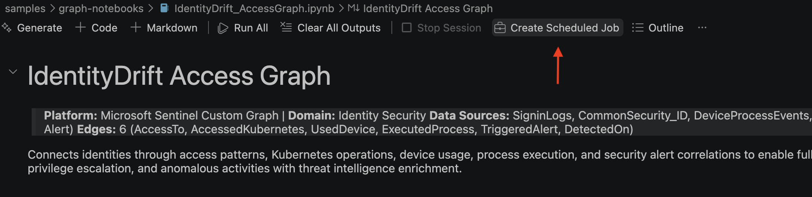
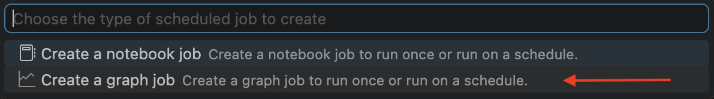
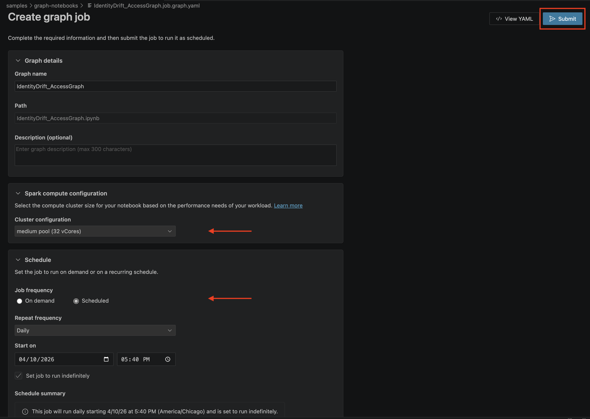

# Build Custom Graph - IdentityDrift Access Analysis

This guide creates a custom security graph from actual IdentityDrift telemetry in Microsoft Sentinel. The graph enables rapid investigation of:
- Which systems did a compromised identity access?
- What lateral movement patterns exist?
- Which Kubernetes cluster operations triggered alerts?
- What devices are involved in suspicious activities?
- Which security alerts were triggered by identity activities?

The graph is built from four key tables from the [Microsoft-Sentinel-Labs KQL-Jobs](https://github.com/suchandanreddy/Microsoft-Sentinel-Labs/tree/main/KQL-Jobs):
- **SigninLogs_KQL_CL** – Azure AD authentication events
- **CommonSecurity_ID_KQL_CL** – IdentityDrift access events
- **DeviceProcessEvents_KQL_CL** – Process execution on endpoints
- **SecurityAlerts_KQL_CL** – Security detections and incidents

## Overview

A custom graph consists of:
- **Nodes:** Entities (Identities, Workloads, Devices, Alerts)
- **Edges:** Relationships between entities (AccessTo, AccessedInfrastructure, UsedDevice, ExecutedProcess, TriggeredAlert, DetectedOn)
- **Properties:** Enriched attributes for investigation context

For IdentityDrift investigation, we'll build a graph showing relationships between identities, the systems they accessed, devices they used, processes they executed, and security alerts they triggered or that detected on systems.

---

## Step 1: Understand the IdentityDrift Table Schema

### Table 1: SigninLogs_KQL_CL (Authentication Events)

**Source:** Entra ID Sign-in logs  
**Key columns:**
```
TimeGenerated              - Event timestamp
UserPrincipalName         - Identity accessing (e.g., u1291@contoso.onmicrosoft.com)
AppDisplayName            - Target application (e.g., Azure Portal, Microsoft Teams)
RiskLevelAggregated       - Risk assessment (low, medium, high)
RiskState                 - Risk indicator (none, atRisk, confirmedCompromised)
RiskDetail                - Specific risk (newDevice, impossibleTravel, anomalousToken)
Location                  - Geographic location (dynamic: countryOrRegion, city, state)
IPAddress                 - Source IP address
DeviceDetail              - Device info as JSON (deviceId, operatingSystem, isCompliant, isManaged)
                            *Parsed using F.get_json_object() in notebook*
ConditionalAccessStatus   - Access policy result (success, failure)
```

**Example events:**
- u1291 normal sign-in: Microsoft Teams from Dallas, TX, USA
- u1291 risky sign-in: Azure Portal from Berlin, Germany (new device)
- u3415 compromised: Microsoft 365 from Beijing, China (impossible travel, flagged)

### Table 2: CommonSecurity_ID_KQL_CL (IdentityDrift Events)

**Source:** Kubernetes cluster access, infrastructure events  
**Key columns:**
```
TimeGenerated             - Event timestamp
SourceUserName            - Identity performing action (e.g., u1291@contoso.onmicrosoft.com)
SourceIP                  - Source IP address
DestinationHostName       - Target system (e.g., prod-aks-eastus, stgprodbackup01)
DeviceCustomString1       - Activity type (MFA Approved, Privilege Escalation, Access Allowed)
DeviceCustomString1Label  - Annotation label
AdditionalExtensions      - Event context (free text description)
```

**Example events:**
- u1291: MFA-approved access to prod-aks-eastus cluster
- u1291: Privilege escalation detected - RoleBinding created with cluster-admin
- u2847: kubectl exec on workload with known vulnerability
- u3415: Service account accessed production backup storage

### Table 3: DeviceProcessEvents_KQL_CL (Process Execution)

**Source:** Microsoft Defender for Endpoint  
**Key columns:**
```
TimeGenerated                    - Event timestamp
DeviceName                       - Client device (e.g., WIN-DESKTOP-CONTOSO-401)
DeviceId                         - Unique device ID
ActionType                       - Process action (ProcessCreated, etc.)
FileName                         - Process name (az.exe, kubectl.exe, powershell.exe)
ProcessCommandLine               - Full command (e.g., "az aks get-credentials --resource-group...")
ProcessIntegrityLevel            - Elevation level (Low, Medium, High)
AccountName                      - User running process (e.g., u1291)
AccountDomain                    - User domain
InitiatingProcessFileName        - Parent process
InitiatingProcessCommandLine     - Parent process command
```

**Example events:**
- u1291: az.exe login (PowerShell parent)
- u3415: az aks get-credentials --resource-group rg-prod --name prod-aks-eastus
- u2847: kubectl get pods -A (elevated: High)

### Table 4: SecurityAlerts_KQL_CL (Security Detections)

**Source:** Microsoft Defender for Cloud, Azure Security Center  
**Key columns:**
```
TimeGenerated             - Event timestamp
DisplayName              - Human-readable alert title
AlertName                - Unique alert identifier (e.g., "K8S.NODE_MalwareBlocked")
AlertSeverity            - Severity level (Critical, High, Medium, Low)
AlertType                - Alert category (K8S.NODE_MalwareBlocked, K8S.RBAC_PrivilegeEscalation)
ConfidenceLevel          - Detection confidence (Low, Medium, High)
IsIncident               - Whether classified as incident (true/false)
Description              - Detailed alert description
CompromisedEntity        - Target system/user affected (e.g., "prod-aks-eastus", "u1291@contoso.com")
Entities                 - Array of affected entities with Type and Name
ProviderName             - Detection source ("Azure Security Center", etc.)
```

**Example alerts:**
- **Malware execution blocked:** Kubernetes node u1291 attempted container escape (High severity, High confidence)
- **Privilege escalation detected:** RoleBinding created with cluster-admin permissions (High severity)
- **Binary drift blocked:** Workload execution deviation from baseline image (Medium severity)
- **Suspicious authentication:** u1291 accessed from impossible travel location (High confidence)

## Step 2: Design Your Graph Schema Based on IdentityDrift

### Node Types

```python
# Node Type 1: Identity
# Represents user accounts or service principals
{
    "label": "Identity",
    "id_field": "UserPrincipalName",  # u1291@contoso.onmicrosoft.com
    "properties": {
        "LastActivity": "datetime",
        "RiskScore": "float",          # 0.0 (low) to 1.0 (high)
        "DistinctAppsAccessed": "int",
        "HighRiskAccessCount": "int"
    }
}

# Node Type 2: Workload
# Represents applications and infrastructure targets
{
    "label": "Workload",
    "id_field": "AppDisplayName",     # Azure Portal, prod-aks-eastus
    "properties": {
        "TotalAccessCount": "int",
        "LastAccessed": "datetime",
        "UniqueIdentities": "int"
    }
}

# Node Type 3: Device
# Represents client devices
{
    "label": "Device",
    "id_field": "DeviceId",           # device-jm-001
    "properties": {
        "DeviceName": "string",
        "OS": "string",               # Windows 11, Linux, macOS
        "IsCompliant": "bool",
        "SignInCount": "int",
        "UniqueUsers": "int"
    }
}

# Node Type 4: Alert
# Represents security detections and incidents
{
    "label": "Alert",
    "id_field": "AlertName",          # K8S.NODE_MalwareBlocked
    "properties": {
        "AlertTitle": "string",       # Display name for investigation
        "Severity": "string",         # Critical, High, Medium, Low
        "Category": "string",         # Alert type category
        "Confidence": "string",       # Detection confidence level
        "IsIncident": "bool",         # Whether escalated to incident
        "AlertCount": "int",          # Number of times triggered
        "LastDetection": "datetime",
        "RiskScore": "float"          # 0.0 to 1.0 based on severity
    }
}
```

### Edge Types

```python
# Edge Type 1: AccessTo
# Identity accessed Application/Workload
{
    "type": "AccessTo",
    "from": "Identity",
    "to": "Workload",
    "properties": {
        "LastActivity": "datetime",
        "AccessCount": "int",
        "HasRiskyAccess": "bool",      # Contains blocked/risky access
        "StatusVariety": "int"         # Different success/failure patterns
    }
}

# Edge Type 2: AccessedInfrastructure
# Identity accessed Infrastructure/Kubernetes resources
{
    "type": "AccessedInfrastructure",
    "from": "Identity",
    "to": "Workload",
    "properties": {
        "LastActivity": "datetime",
        "EventCount": "int",
        "ActivityTypes": ["MFA Approved", "Privilege Escalation", ...],
        "SourceIPCount": "int"         # Different IPs used
    }
}

# Edge Type 3: UsedDevice
# Identity used a Device to access resources
{
    "type": "UsedDevice",
    "from": "Identity",
    "to": "Device",
    "properties": {
        "SignInCount": "int",
        "ProcessCount": "int",
        "LastActivity": "datetime"
    }
}

# Edge Type 4: ExecutedProcess
# Identity executed a process on a Device
{
    "type": "ExecutedProcess",
    "from": "Identity",
    "to": "Process",
    "properties": {
        "ProcessName": "string",
        "ExecutionCount": "int",
        "DistinctCommands": "int"
    }
}

# Edge Type 5: TriggeredAlert
# Identity triggered a Security Alert
{
    "type": "TriggeredAlert",
    "from": "Identity",
    "to": "Alert",
    "properties": {
        "TriggerCount": "int",        # Number of times identity triggered alert
        "LastTriggerTime": "datetime",
        "MaxSeverity": "float"        # Max severity value (0.0-1.0)
    }
}

# Edge Type 6: DetectedOn
# Alert was detected/triggered on a Workload/System
{
    "type": "DetectedOn",
    "from": "Alert",
    "to": "Workload",
    "properties": {
        "DetectionCount": "int",      # Alert fired multiple times on this workload
        "LastDetection": "datetime",
        "MaxSeverity": "float",       # Severity of detection
        "Description": "string"       # Alert description for context
    }
}
```

## Step 3: Use the Graph Notebook

The custom graph is built using a Spark notebook that:
1. Reads all source tables (including SecurityAlerts)
2. Extracts and normalizes nodes
3. Creates relationships as edges
4. Outputs nodes and edges to Data Lake tables

### 3.1 Open Graph Notebook in VS Code

1. Open **Microsoft Sentinel** extension
2. Expand **Graphs** → **Notebooks**
3. Click **Use existing notebook**
4. Select: [IdentityDrift_AccessGraph.ipynb](../samples/graph-notebooks/IdentityDrift_AccessGraph.ipynb)

### 3.2 Configure Notebook Parameters

Before running, update the first code cell:

```python
workspace_name = "YourSentinelWorkspace"      # Your workspace name (required)

# Source tables (from Data Lake):
# - SigninLogs_ID_KQL_CL          (Azure AD authentication events)
# - CommonSecurity_ID_KQL_CL      (Kubernetes/Infrastructure access)
# - DeviceProcessEvents_KQL_CL    (Process execution on endpoints)
# - SecurityAlerts_KQL_CL         (Security detections and incidents)

# Analysis period (configurable)
TIME_WINDOW_DAYS = 1  # Change to 7, 14, or 30 for longer analysis windows
```

### 3.3 Run the Notebook

1. Click **Run All** or run cells sequentially
2. Monitor progress in notebook output
3. The notebook builds the graph in memory using GraphSpecBuilder
4. Final cell validates the graph with node and edge counts

**Expected completion output:**
```
Graph build completed successfully!
Graph Name: <>
Nodes: 18
Edges: 38
```
---

## Step 4: Notebook Cell Breakdown

The notebook is organized as follows:

| Cell | Purpose |
|------|---------|
| 1 | Configuration: workspace_name, TIME_WINDOW_DAYS |
| 2 | Import libraries and initialize Sentinel provider |
| 3 | Load source tables with time window filter |
| 4 | Extract node DataFrames: Identity nodes from SigninLogs & CommonSecurity |
| 5 | Extract node DataFrames: Workload, Device, Alert nodes |
| 6 | Extract edge DataFrames: AccessTo, AccessedInfrastructure, UsedDevice |
| 7 | Extract edge DataFrames: ExecutedProcess, TriggeredAlert, DetectedOn |
| 8 | Build graph specification using GraphSpecBuilder |
| 9 | Build graph from specification with Graph.build() |
| 10 | Validate graph: show node and edge counts |

## Step 5: Schedule Notebook as Graph Job

### 5.1 Create Graph Job to Run Notebook Regularly

1. In VS Code, click on **Create Scheduled Job**



2. Select **Create a graph job**



3. Select Spark Compute Configuration, Schedule and Submit the Job. 



## Next Steps

- **Build Security Copilot agent:** [04-Build-Security-Copilot-Agent](./04-Build-Security-Copilot-Agent.md)
