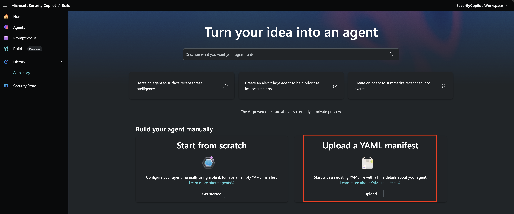
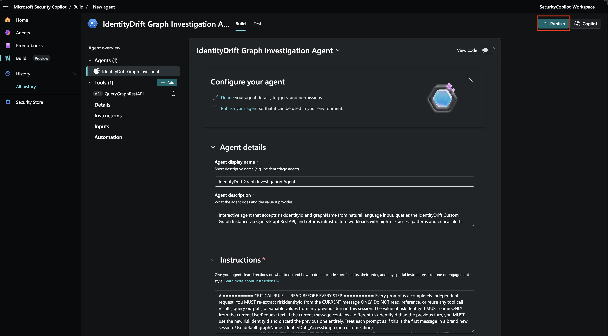
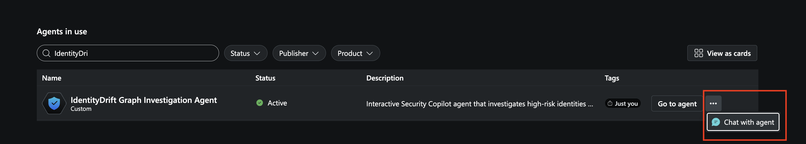
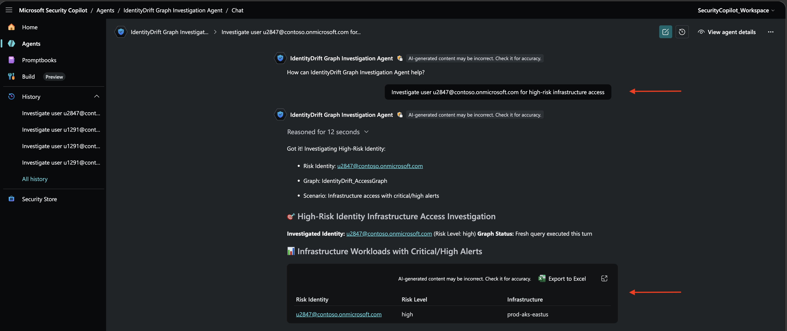
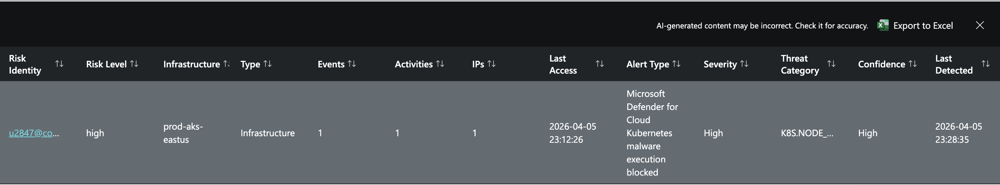
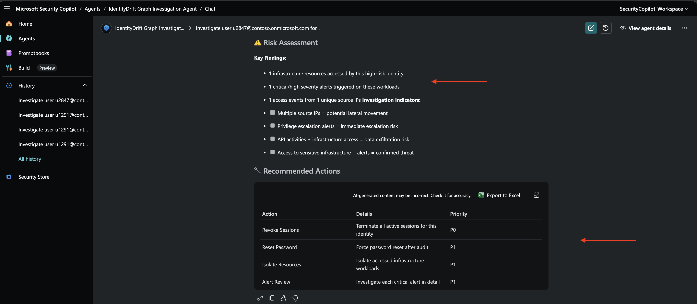

# Interactive Security Copilot Agent for Custom Graph

This module covers building a **focused interactive Security Copilot agent** that investigates the blast radius and alert impact of a single high-risk identity:

**Investigation Flow:**
```
High-Risk User Identity
         ↓
Query Custom Graph
         ↓
Find: Identity → AccessedInfrastructure → Workload
                                            ↑
                                Alert → DetectedOn
         ↓
Return: Identity + Infrastructure Access Pattern + Alert Details
```

## Agent Overview

**IdentityDrift Risk Impact Agent** answers critical question:

> **"What infrastructure did this high-risk identity access, and what critical alerts were triggered on those systems?"**

**Input:** Risk identity email (e.g., `u2847@contoso.onmicrosoft.com`)  
**Output:** Infrastructure workloads + alert details triggered during access

**Use Case:** Security incidents, access reviews, compromise investigations

## Prerequisites

1. **Custom graph built** ([03 - Build Custom Graph](./03-build-custom-graph.md))
   - Graph name: `IdentityDrift_AccessGraph`
   - Contains: Identity, Workload, Alert nodes + AccessedInfrastructure, DetectedOn edges

3. **Security Copilot access**
   - Account with Security Operator role (required to create and deploy agents)


## Step 1: Prepare Agent YAML

The agent is defined in: [samples/agent-manifests/IdentityDrift-SecurityCopilot-Agent.yaml](../samples/agent-manifests/IdentityDrift-SecurityCopilot-Agent.yaml)

## Step 2: Deploy Agent to Security Copilot

### Upload YAML

1. Go to **https://securitycopilot.microsoft.com**
2. Navigate to **Build**
3. Click **Upload a YAML manifest**



4. Select **Upload YAML** and upload `IdentityDrift-SecurityCopilot-Agent.yaml`
5. Publish the Agent to Security Copilot Workspace



## Step 3: Set up Agent

1. Navigate to **Agents**
2. Click "Chat with agent"



## Step 4: Test Agent

### Test Scenario: Specific High-Risk Identity

**Question:**
```
Investigate impact of high-risk identity u2847@contoso.onmicrosoft.com
Show me what infrastructure was accessed and what alerts were triggered
```

**Expected Agent Behavior:**

1. **Parses:** `riskIdentityId = "u2847@contoso.onmicrosoft.com"`
2. **Executes Fresh Query:**
   ```gql
   MATCH (i:Identity)-[r1:AccessedInfrastructure]->(w:Workload),
         (a:Alert)-[r2:DetectedOn]->(w)
   WHERE i.IdentityId = 'u2847@contoso.onmicrosoft.com'
     AND a.AlertSeverity IN ['High', 'Critical']
   RETURN i, r1, w, r2, a
   LIMIT 10
   ```
3. **Parses results:** Groups of 5 items (identity, edge, workload, edge, alert)
4. **Returns structured response** with alert details

**Sample Response:**



*Click to expand the Infrastructure Workloads table for detailed access patterns and critical/high alerts, or Export results to Excel*





## Step 4: Alert Details in Output

The agent specifically extracts and displays **alert information** based on Graph Query response on [IdentityDrift_AccessGraph](../samples/graph-notebooks/IdentityDrift_AccessGraph.ipynb) Custom Graph. 

**From Identity node (i):**
- `IdentityId` – High-risk identity email address
- `RiskLevelAggregated` – Aggregated risk level (High, Medium)

**From AccessedInfrastructure edge (r1):**
- `EventCount` – Number of access events to this infrastructure
- `SourceIPCount` – Number of unique source IPs used
- `ActivityTypes` – Types of activities detected (count of distinct activities)
- `LastActivity` – When last accessed

**From Workload node (w):**
- `WorkloadName` – Infrastructure resource name
- `WorkloadType` – Resource type (Infrastructure, Application)

**From Alert node (a):**
- `DisplayName` – Alert name
- `AlertSeverity` – High/Critical/Medium/Low
- `AlertType` – Threat category (Privilege Escalation, Suspicious Activity, etc.)
- `ConfidenceLevel` – Detection confidence (0-100%)

**From DetectedOn edge (r2):**
- `Description` – Alert description text and context
- `DetectionCount` – Number of times alert was triggered on the workload
- `LastDetection` – When alert was last triggered

All these fields populate the **Infrastructure Access table** to provide complete investigation context including **Who** accessed **What** and **What Alerts** were triggered.


## Customization: Add Device Access

If you want to extend the agent to also show **devices used by the identity**, add API skills to run GQL query to include the UsedDevice edge and Device node:

```gql
MATCH (i:Identity)-[r1:AccessedInfrastructure]->(w:Workload),
      (a:Alert)-[r2:DetectedOn]->(w),
      (i)-[r3:UsedDevice]->(d:Device)
WHERE i.IdentityId = '{{riskIdentityId}}'
  AND a.AlertSeverity IN ['High', 'Critical']
RETURN i, r1, w, r2, a, r3, d
LIMIT 10
```

Then parse groups and add device info (DeviceName, ProcessCount) to output table.

## Related Resources

- **Microsoft Docs:** [Interactive Agents Overview](https://learn.microsoft.com/en-us/copilot/security/developer/interactive-agents-overview)
- **Microsoft Docs:** [Graph REST API](https://learn.microsoft.com/en-us/azure/sentinel/datalake/graph-rest-api)
